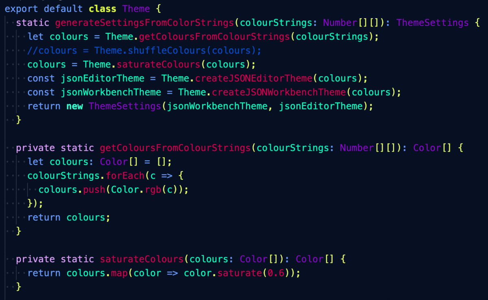

# ColorCode

**A VS Code extension that can generate color themes for your workspace!** ColorCode is powered by [Colormind.io](http://colormind.io/) which means themes are randomly generated by a sophisticated algorithm. ColorCode gives you infinitely many themes so you can find the perfect theme for you with just one extension. If you find a theme you like you can save it too. Colormind.io changes the source material for their generator every day so themes will continue to have a different feel to them.

## Features

Generate a new theme by running the command 'ColorCode: Generate Theme'.

Save your theme by running the command 'ColorCode: Save Current Theme' and giving your theme a name.

Delete your theme by running the command 'ColorCode: Delete Theme' and supplying the name of a saved theme.

Load a theme by running the command 'ColorCode: Load Theme' and supplying the name of a saved theme.

# Installation

1.  Install [Visual Studio Code](https://code.visualstudio.com/)
2.  Launch Visual Studio Code
3.  Choose **Extensions** from menu
4.  Search for `ColorCode`
5.  Click **Install** to install it
6.  Click **Reload** to reload the Code

# Using ColorCode

Once the extension is installed you can test it out by doing the following:

1.  From the menu bar click: Code > Preferences > Color Theme > **ColorCode**
2.  From the menu bar click: View > Command Palette
3.  From the Command Palette select **Color Code: Generate Theme**

Once you have found a theme you like you can save it by doing the following:

1.  From the menu bar click: View > Command Palette
2.  From the Command Palette select **Color Code: Save Current Theme**
3.  Enter a name for your theme and hit **Enter**

If you want to reload a theme you can access it by doing the following:

1.  From the menu bar click: View > Command Palette
2.  From the Command Palette select **Color Code: Load Theme**
3.  Enter the name of the theme you wish to load and hit **Enter**

If you decide you don't want to keep a theme you can delete it by doing the following:

1.  From the menu bar click: View > Command Palette
2.  From the Command Palette select **Color Code: Delete Theme**
3.  Enter the name of the theme you wish to delete and hit **Enter**

If you find a theme you want to share with people you can do the following:

1.  From the menu bar click: View > Command Palette
2.  From the Command Palette select **Color Code: Generate Code From Current Theme**
3.  Click **Copy To Clipboard** on the message box
4.  Send this code to anyone with whom you wish to share your theme

When you have a theme code you can load it by doing the following:

1.  From the menu bar click: View > Command Palette
2.  From the Command Palette select **Color Code: Read Theme Code**
3.  Enter the code of the theme you wish to load and hit **Enter**

## Release Notes

### 1.0.0

Initial release of ColorCode

## Misc

This is my first VS Code extension, so if you find that there are issues with ColorCode then please feel free to [file an issue](https://github.com/gabrielbarker/colorcode/issues)! I'm certain there will be things I missed.

Any relevant changes for each version are documented in the changelog. Please update and check the changelog before filing any issues, as they may have already been taken care of.

This extension will undoubtably produce less thorough and well balanced themes as the many exceptional themes on VS Code. It is intended as a solution to the problem of growing tired of a theme and wanting to freshen up your workspace, without finding and installing a new theme. I hope it brings some color to your development!

Special thanks to Beth Williamson for the awesome logo design!

## Contributors

Thanks a lot to:

- [@ctf0](https://github.com/ctf0)
